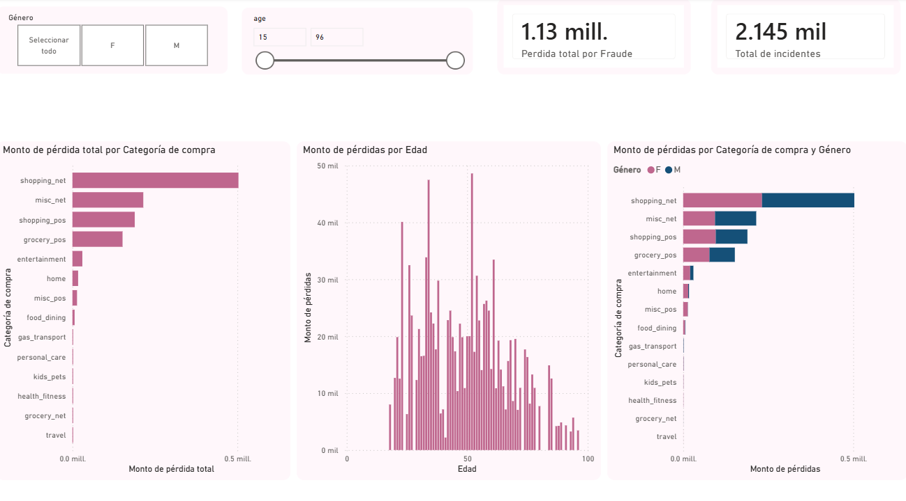

# Bank Fraud Detection & Analytics Dashboard

Análisis integral de un conjunto de datos con más de 550,000 registros de transacciones bancarias con el objetivo de identificar patrones de fraude, cuantificar el impacto financiero y segmentar el comportamiento de los atacantes por categorías, edad y género.

---

## Estructura:
*   `python/`: Contiene la libreta de Google Colab (`.ipynb`) con todo el pipeline de análisis exploratorio, limpieza en Pandas y consultas SQL unificadas.
*   `dashboard/`: Captura de pantalla en alta definición del reporte interactivo final[cite: 1].

---

## Dashboard en Power BI

Se presenta la interfaz interactiva final diseñada para la toma de decisiones financieras en la prevención de fraudes:

---

## Insights Clave:

Después del análisis de datos en Python, consultas SQL y la visualización interactiva, se extrajeron los siguientes hallazgos críticos para la toma de decisiones del banco[cite: 1]:

*   **Impacto Financiero Total:** Se identificaron **2,145 incidentes de fraude**, acumulando una pérdida neta total de **$1.13 millones de dólares** para la institución.
*   **Categorías vulnerables:** La categoría de `shopping_net` (compras en línea) representa la principal vía de fuga de capital por fraude, superando por mucho a las transacciones físicas.
*   **Segmentación Demográfica:** 
    *   Los ataques se concentran con gran fuerza en usuarios adultos de entre **30 y 45 años**.
    *   Existe una participación ligeramente mayor en hombres dentro de las categorías de compras online de mayor impacto financiero, mientras que el perfil femenino lidera en otras categorías secundarias.

---

## Tecnologías Utilizadas:
*   **Python (Pandas):** Limpieza, manejo de tipos de datos y análisis exploratorio inicial.
*   **SQL (Embedded en Colab):** Estructuración de consultas para validación y cálculo de KPIs.
*   **Power BI:** Modelado de datos, diseño de interfaz ejecutiva y segmentadores interactivos.
